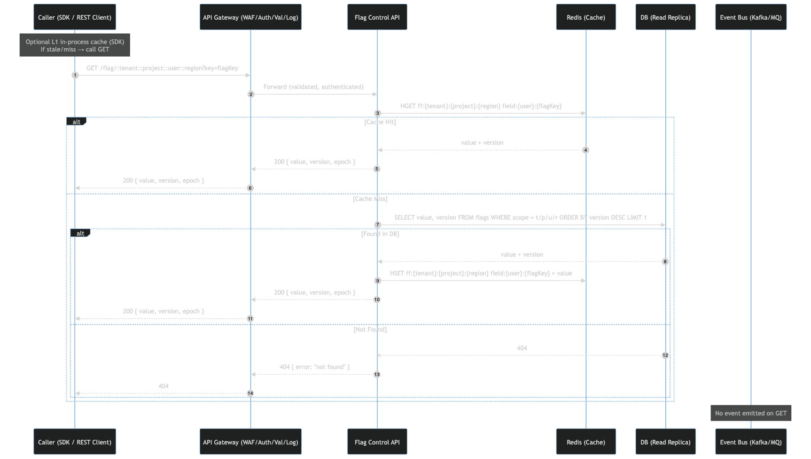
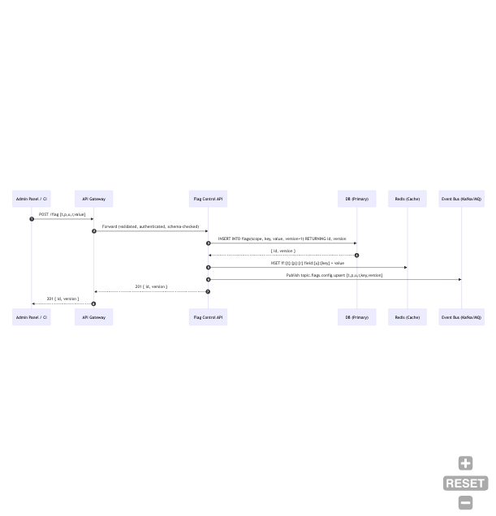
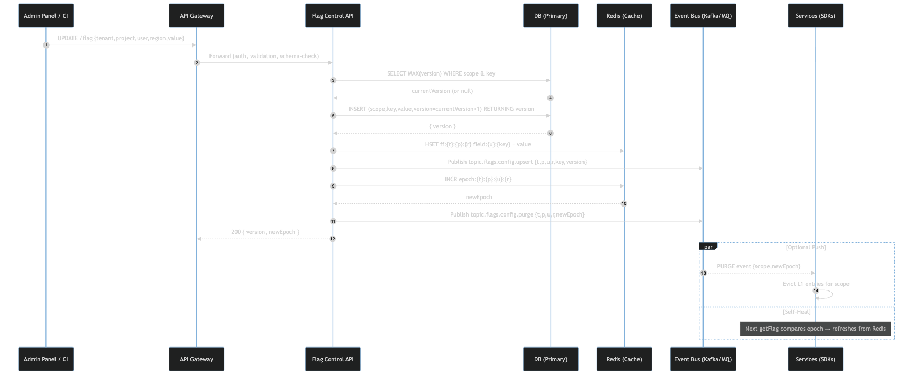
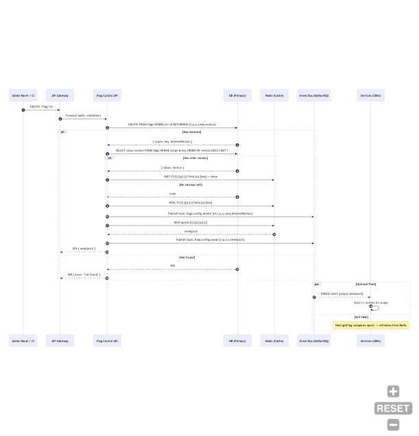

Type-Safe Feature Flag System

## Objectives

- Propose a type-safe, multi-tenant feature flag system. Te design should emphasize compile time safety, resilient behavior and rollout across distributed deployments.
- Avoid runtime flag mistakes through centrally defined, strongly typed contracts.
- Deliver low-latency, real-time flag updates to every service instance.
- Support per-tenant, per-user, and per-region targeting with gradual rollouts.
- Provide graceful degradation, versioned schemas, and operational guardrails that protect production.
- SDK provide a local cache with short TTL to prevent overfetching to the feature flag system
- A purge feature which can force update client machine cache or existing flag value. This is ideal if vulnerability or risk found and require immediate action.

## Architecture Overview


Components function:

- **Admin Panel**: entry point for project user to have an UI interface to perform actions.

- **SDK**: A typescript SDK for the client user to use in their repository to make use of their feature flag. Include client side caching.

- **Flag API/Gateway**: entry point for all the APIs action. Responsible on function such as logging, filtering, auth, and rate limiting and routing

- **Control Plane**: cluster of engine responsible on interating, validating, publishing, subscribing to database/redis/event tools(redis stream/kafka) on the Feature Flag

- **Primary DB**: database storage

- **Observability**: Set of services to collect metrics and logs from microservices to ensure the microservices availability and perform alert if unusual activities

- **Microservices** : Set of microservices to perform the misc features such as payments, analytics and etc.

- **Event Bus(MQ or Kafka)**: List of channel created dedicated depending on the tenant:project:user and be consume by the sdk

- **Redis**: Used to reduce load handled by database and ensure high performance of the system.

## Basic API Definitions

ADMIN control plane (User can retrieve, create, update, delete and purge the feature flags)

1. `GET /flag/tenant:project:user:region`



2. `POST /flag Accepted body {tenant, project, user, region, value}`



3. `UPDATE /flag ccepted body {tenant, project, user, region, value}`
   `//An update to the key does not override the value but introduce a new row of record with increment version value to persist the older copy`



4. `DELETE /flag/:id `



5. `PUT /flag/tenant:project:user:region `
   `//The purpose of this is to purge the existing flag and enforce an update on the flag`


## Multi-Tenant Data Model

- **Namespaces:** `{tenantId}:{environment}:{flagKey}` scoping in Redis and DB for isolation.
- **Segments:** Dedicated event bus `{tenantId}:{environment}:{flagKey}` The design able to scale up service just to serve dedicated flag which has more demand
- **Audit metadata:** tracked per flag change: actor, timestamp, rollout rationale, TTL.

## SDK Responsibilities

- **Strong typing:** `getFlag<K>()` returns `Promise<K>`; type narrowing works automatically.

```ts
export class FeatureFlagClient {
  constructor(private baseUrl: string) {}

  async getFlag<T>(tenant: string, region: string, key: string): Promise<T> {
    const url = `${this.baseUrl}/flag/${tenant}:${region}:${key}`;
    const res = await fetch(url);

    // validation etc

    const data = (await res.json()) as T;
    return data;
  }
}

// usage

interface NewFeatureFlag {
  enabled: boolean;
  rollout: number;
  message?: string;
}

const client = new FeatureFlagClient("https://api.mycompany.com");
const flag = await client.getFlag<NewFeatureFlag>(
  "tenantA",
  "MY",
  "new-feature"
);

if (flag.enabled && flag.rollout > 0.5) console.log(flag.message);
```

- **Local cache:** In-process map keyed by `tenantId`, `environment`, `flagKey`.
- **Fallbacks:** On cache miss or validation error, return default-off (safe) values and emit metrics.
- **Evaluation helpers:** utilities for percentage rollouts, segment checks, and contextual rules.
- **Resilience:** Circuit-breaker for Redis; exponential backoff on reconnect; optional disk-backed warm cache for cold starts.

## Targeting & Rollouts

- **Percentage rollout:** deterministic hash (`hash(userId, flagKey) % 100 < rolloutPct`).
- **Segment gating:** membership check against pre-computed Redis segment keys.
- **Hierarchical evaluation:** global defaults → tenant overrides → user-region overrides.
- **Kill switch:** control plane can mark a flag as disabled; SDK treats as hard off immediately.
- **Flag TTLs:** metadata ensures short-lived experiments auto-expire; CI warns on stale flags.

## Versioning & Schema Evolution

- **Flag versions:** breaking changes create new keys (`regionalDiscount@v2`); old versions remain until sunset.
- **Schema registry:** control plane stores JSON Schemas; SDK downloads matching version bundle.
- **Runtime validation:** SDK re-validates payloads on load, logging schema drift/junk data.

## Testing Strategy

- **Unit tests:** enforce both flag-off and flag-on branches; baseline suite runs with all flags off.
- **Integration tests:** simulate Redis cache misses, stale segments, and CDC delays.
- **E2E / canary:** limited rollout pipelines (1% traffic) before full enablement.
- **CI guard:** block merge if new schemas lack SDK support or if stale flags exceed SLA.

## Operational Practices

- **Observability:** metrics for flag evaluation latency (<100 µs target), cache staleness, and failed validations; distributed tracing attributes flag states per request.
- **Alerting:** on propagation delay >2 s, on kill-switch activation, and on cache fallback usage spikes.
- **Multi-region:** Redis Global Datastore / MemoryDB with active-active replication; control plane enforces per-region quorum for changes.
- **Security:** RBAC on control plane, per-tenant API tokens, and TLS + ACLs for Redis. Optionally include customer-managed encryption keys for sensitive flag payloads.
- **Disaster recovery:** regular backups of DB + Redis snapshots, runbooks for region evacuation, and synthetic traffic tests for failovers.
